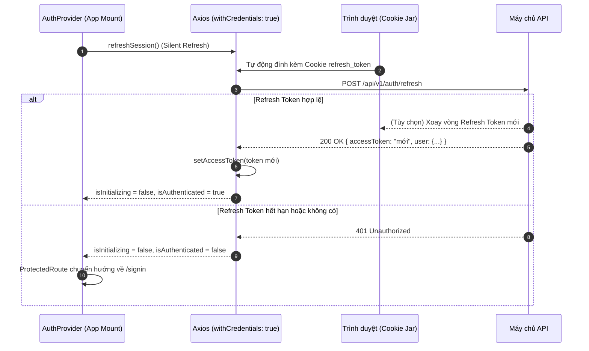
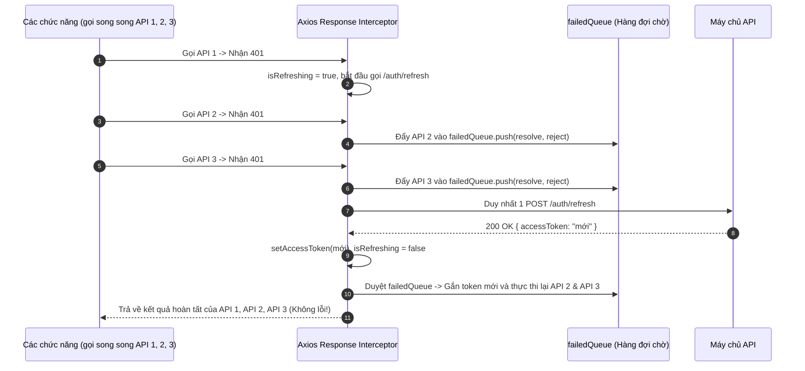

# KIẾN TRÚC XÁC THỰC AN TOÀN VỚI ACCESS TOKEN & REFRESH TOKEN LƯU Ở HTTPONLY COOKIE
*Dự án: AIMS Enterprise IT Asset Management*

---

## 1. TỔNG QUAN & TẠI SAO LẠI CHỌN MÔ HÌNH NÀY?

Trong các ứng dụng Web Application hiện đại (Single Page Application - SPA), cách lưu trữ Token quyết định mức độ an toàn của toàn bộ hệ thống:

| Phương pháp lưu trữ | Rủi ro XSS (Mã độc JavaScript) | Rủi ro CSRF (Giả mạo yêu cầu) | Đánh giá an toàn |
| :--- | :--- | :--- | :--- |
| **`localStorage` / `sessionStorage`** | ❌ **Cực kỳ nguy hiểm**: Bất kỳ lỗ hổng XSS nào cũng có thể đọc trộm và gửi token ra ngoài | ✅ Không bị ảnh hưởng | ⚠️ **Không khuyến nghị** cho dữ liệu quan trọng |
| **HttpOnly Cookie (Pure)** | ✅ **Miễn nhiễm XSS**: JavaScript không thể đọc được | ⚠️ Cần thêm cơ chế chống CSRF | Rất tốt, nhưng cần xử lý CORS cẩn thận |
| **Mô hình Hybrid (AIMS Implementation)** | ✅ **Miễn nhiễm XSS hoàn toàn**: Refresh Token ở HttpOnly Cookie, Access Token ở JS In-Memory | ✅ **Miễn nhiễm CSRF**: Access token ở Memory + Header `X-Requested-With` | 🏆 **Chuẩn bảo mật cao nhất của OWASP** |

---

## 2. NGUYÊN LÝ HOẠT ĐỘNG (ARCHITECTURE & LIFECYCLE)

### A. Access Token (In-Memory)
- **Vị trí lưu**: Biến cục bộ trong bộ nhớ runtime của JavaScript (`src/library/axios.ts`).
- **Thời hạn sống (TTL)**: Ngắn (thường từ **5 - 15 phút**).
- **Cách dùng**: Tự động gắn vào header `Authorization: Bearer <access_token>` của từng request.
- **Ưu điểm**: Khi người dùng đóng tab hoặc kẻ tấn công cố tình inject script, script **không thể truy cập bộ nhớ của biến closure**.

### B. Refresh Token (HttpOnly Cookie)
- **Vị trí lưu**: Cookie do máy chủ cấp phát với cờ `HttpOnly`.
- **Cấu hình cờ bảo mật bắt buộc**:
  - `HttpOnly`: Trình duyệt cấm hoàn toàn `document.cookie` đọc hoặc ghi cookie này.
  - `Secure`: Cookie chỉ được truyền qua giao thức mã hóa HTTPS.
  - `SameSite=Strict` (hoặc `SameSite=Lax`): Ngăn chặn trình duyệt gửi cookie trong các ngữ cảnh Cross-Site giả mạo.
  - `Path=/api/v1/auth`: Thu hẹp phạm vi gửi cookie chỉ cho các API xác thực (`/login`, `/refresh`, `/logout`), không gửi tràn lan trong các request tĩnh.
- **Thời hạn sống (TTL)**: Dài hơn (**7 ngày - 30 ngày**).

---

## 3. LUỒNG XỬ LÝ CHI TIẾT (FLOW DIAGRAMS)

### Luồng 1: Đăng nhập (Login)
```mermaid
sequenceDiagram
    autonumber
    actor User as Người dùng
    participant UI as Giao diện SignIn.tsx
    participant Axios as Axios Client (withCredentials)
    participant Backend as Máy chủ API (Auth Server)
    participant CookieJar as Trình duyệt (Cookie Jar)

    User->>UI: Nhập username + password
    UI->>Axios: login(credentials)
    Axios->>Backend: POST /api/v1/auth/login
    Note over Backend: Kiểm tra tài khoản & mật khẩu<br/>Tạo cặp Access Token & Refresh Token
    Backend-->>CookieJar: Set-Cookie: refresh_token=...; HttpOnly; Secure; SameSite=Strict; Path=/api/v1/auth
    Backend-->>Axios: 200 OK { accessToken: "eyJ...", user: { ... }, accessTokenExpiresAt: "..." }
    Axios->>Axios: setAccessToken(accessToken) [In-Memory]
    Axios-->>UI: Cập nhật AuthContext state (isAuthenticated = true)
    UI->>User: Chuyển hướng vào trang Dashboard
```

---

### Luồng 2: F5 hoặc Mở tab mới (Silent Refresh)
Khi người dùng tải lại trang, biến In-Memory Access Token bị xóa (`null`). `AuthProvider` tự động khôi phục phiên:


---

### Luồng 3: Concurrency Queue & Token Rotation khi gặp 401
Nếu 5 request đồng thời nhận 401 (do Access Token hết hạn), giải pháp **Single-Flight Mutex + Failed Queue** giúp tránh gửi 5 request refresh trùng lặp:



---

## 4. HƯỚNG DẪN TRIỂN KHAI PHÍA BACKEND

### A. Node.js (Express.js / NestJS)
```typescript
import { Response } from 'express';

// 1. Khi Đăng nhập thành công:
export function handleLoginSuccess(res: Response, user: User) {
  const accessToken = generateAccessToken(user);   // 15 phút
  const refreshToken = generateRefreshToken(user); // 7 ngày

  // Lưu refresh token vào HttpOnly Cookie
  res.cookie('refresh_token', refreshToken, {
    httpOnly: true,                                // Chống XSS
    secure: process.env.NODE_ENV === 'production', // Chỉ gửi qua HTTPS
    sameSite: 'strict',                            // Chống CSRF
    path: '/api/v1/auth',                          // Phạm vi hẹp
    maxAge: 7 * 24 * 60 * 60 * 1000,              // 7 ngày
  });

  return res.json({
    accessToken,
    accessTokenExpiresAt: new Date(Date.now() + 15 * 60 * 1000).toISOString(),
    user: {
      id: user.id,
      username: user.username,
      fullName: user.fullName,
      roles: user.roles,
    },
  });
}

// 2. Cấu hình CORS cho phép Cookie từ Frontend:
app.use(cors({
  origin: ['http://localhost:5173', 'https://asset.aims.vn'],
  credentials: true, // BẮT BUỘC để trình duyệt nhận cookie
}));
```

### B. ASP.NET Core (C#)
```csharp
// 1. Đặt HttpOnly Cookie trong AuthController.cs
Response.Cookies.Append("refresh_token", refreshToken, new CookieOptions
{
    HttpOnly = true,
    Secure = true,
    SameSite = SameSiteMode.Strict,
    Path = "/api/v1/auth",
    Expires = DateTimeOffset.UtcNow.AddDays(7)
});

// 2. Cấu hình CORS trong Program.cs
builder.Services.AddCors(options =>
{
    options.AddPolicy("AllowAimsFrontend", policy =>
    {
        policy.WithOrigins("http://localhost:5173", "https://asset.aims.vn")
              .AllowCredentials()
              .AllowAnyHeader()
              .AllowAnyMethod();
    });
});
```

### C. Java (Spring Boot)
```java
ResponseCookie cookie = ResponseCookie.from("refresh_token", refreshToken)
    .httpOnly(true)
    .secure(true)
    .path("/api/v1/auth")
    .maxAge(Duration.ofDays(7))
    .sameSite("Strict")
    .build();

return ResponseEntity.ok()
    .header(HttpHeaders.SET_COOKIE, cookie.toString())
    .body(new AuthResponse(accessToken, expiresAt, userDto));
```

---

## 5. TỔNG KẾT CÁC FILE ĐÃ TRIỂN KHAI PHÍA FRONTEND

1. **`src/types/auth.ts`**: Hệ thống kiểu dữ liệu TypeScript nghiêm ngặt (`AuthUser`, `LoginCredentials`, `AuthResponse`, `AuthState`, `AuthContextValue`).
2. **`src/library/axios.ts`**:
   - `withCredentials: true` (truyền/nhận HttpOnly Cookie).
   - In-memory `accessToken` (không lưu storage).
   - Header chống CSRF `X-Requested-With: XMLHttpRequest`.
   - Cơ chế hàng đợi `failedQueue` và khóa `isRefreshing` (Single-Flight Promise).
   - Callbacks thông báo hết hạn phiên `onSessionExpired` và sự kiện `aims:auth-expired`.
3. **`src/api/auth.api.ts`**: Các hàm gọi API `login()`, `refreshSession()`, `logout()`, `getCurrentUser()` kèm chế độ Dev Simulation thông minh khi backend offline.
4. **`src/context/AuthContext.tsx` & `src/hooks/useAuth.ts`**:
   - Quản lý phiên làm việc tập trung.
   - Cơ chế **Silent Refresh** khi khởi tạo ứng dụng.
   - Cơ chế **Proactive Refresh Timer** (tự động làm mới trước khi Access Token hết hạn 1 phút).
   - Phương thức kiểm tra quyền `hasRole()`, `hasAnyRole()`, `hasPermission()`.
5. **`src/components/auth/ProtectedRoute.tsx`**:
   - Bảo vệ toàn bộ không gian làm việc của `AppLayout`.
   - Splash Screen mượt mà trong khi xác thực cookie ban đầu (`isInitializing`).
   - Tự động chuyển hướng về `/signin?redirect=...` khi chưa đăng nhập.
   - Hỗ trợ chặn quyền 403 Forbidden theo vai trò (RBAC).
6. **`src/components/auth/PublicOnlyRoute.tsx`**: Chuyển hướng người dùng đã có phiên làm việc ra khỏi trang `/signin`, `/signup`.
7. **`src/pages/AuthPages/SignIn.tsx`**: Tích hợp gọi `auth.login()`, hỗ trợ nút chọn tài khoản mẫu (Super Admin, IT Admin, HR Manager), và banner bảo mật HttpOnly Cookie.
8. **`src/components/header/UserDropdown.tsx`**: Hiển thị thông tin thực tế của tài khoản đang đăng nhập và nút "Đăng xuất an toàn" giải phóng cookie & memory.
9. **`src/App.tsx`**: Tích hợp bọc `<AuthProvider>`, `<ProtectedRoute>`, và `<PublicOnlyRoute>`.
